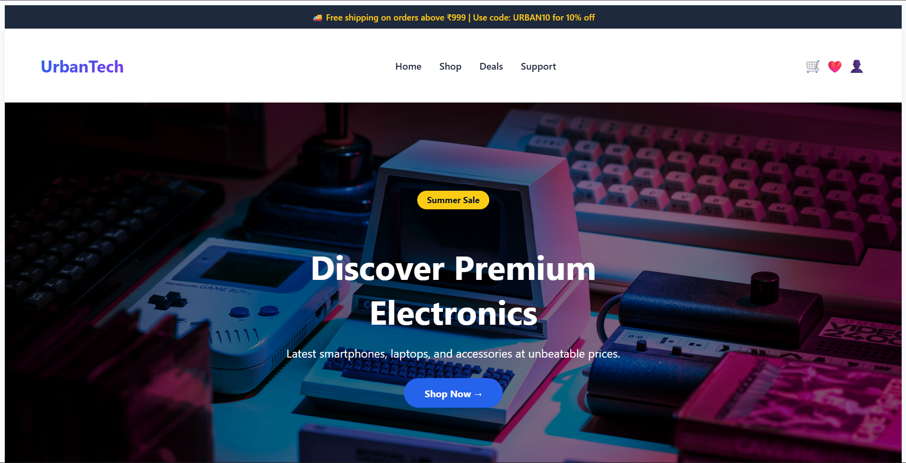

# UrbanTech – Premium Electronics Store 




A modern, responsive e‑commerce homepage built with React.  
This project focuses on a **realistic, single‑page** user interface with product browsing, category filtering (via alerts), and a newsletter signup.

## 🚀 Live Demo 
Just run locally – the homepage is fully functional with mock data and interactive alerts.

## ✨ Features

- **Sticky announcement bar** with promo message  
- **Modern navbar** with logo, navigation links, and cart/wishlist icons  
- **Hero section** with a “Shop Now” call‑to‑action (alert popup)  
- **Shop by category** – 6 clickable cards showing an alert (simulates filtering)  
- **Featured products** – displays 4 products from a local data file; each “View Product” button shows an alert  
- **Customer testimonials** – two static reviews with star ratings  
- **Newsletter subscription** – email input with validation (shows a thank‑you alert)  
- **Responsive footer** – quick links, social media icons, and copyright  
- **Fully responsive** – works on mobile, tablet, and desktop  

## 🛠️ Tech Stack

- **React 18** – component‑based UI  
- **CSS3** – custom styling with Flexbox / Grid, hover effects, and gradients  
- **JavaScript (ES6)** – state management for newsletter email, event handlers  

No routing, no external libraries – only pure React.

## 📦 Installation

1. **Clone the repository**  
   ```bash
   git clone https://github.com/your-username/urbantech-homepage.git
   cd urbantech-homepage
